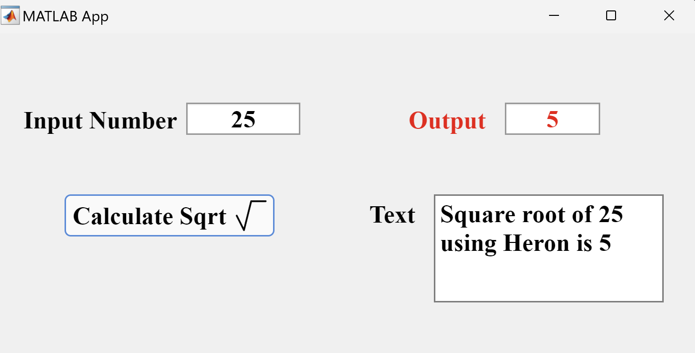
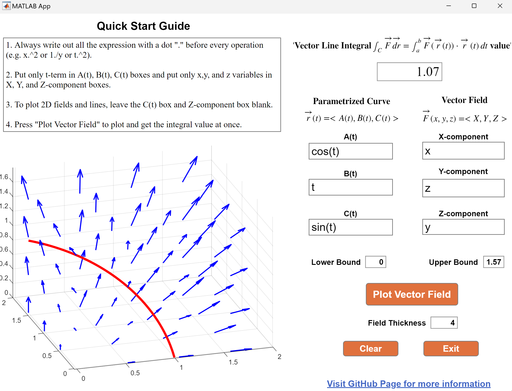

# MATLAB-GUI

This project simplifies Multivariable Calculus and Linear Algebra concepts with interactive simulations and real-world engineering examples using MATLAB and Python, guided by Professor Heze Chen from the University of Virginia's Department of Applied Mathematics, inspired by UVA's APMA 2120 and APMA 3080 courses.

Last updated by Huy Nguyen - March 2024

## [1. Square Root Function GUI](./square_root_function/)

## [2. Vector Field Plot GUI (read more)](./vector_field_plot/)

## [3. Vector Field Plot and Line Integral GUI (read more)](./line_integral/)

