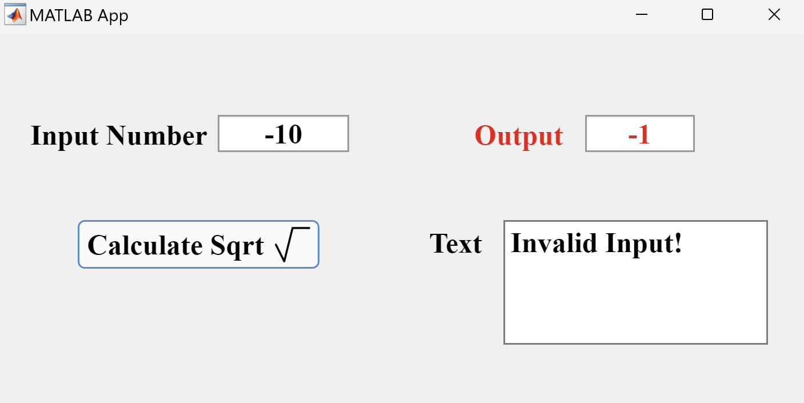

# Square Root App Using Heron

Welcome to the Square Root App using Heron! This MATLAB app provides a convenient and user-friendly interface for calculating the square root of a given number using Heron's formula. Heron's formula is a classic method for finding the square root of a number, and this app simplifies the process.

## How It Works

### Base Design

When you open the app, you'll see a clean and straightforward interface. There's an input box where you can enter the number for which
you want to calculate the square root. The interface is designed to be intuitive and easy to use.

### Valid Input Demo

   
After you've entered a valid numeric value in the input box, simply click the "Calculate Sqrt" button. The app will process your input using Heron's formula, and the result, 
which is the square root of the input number, will be displayed in another box. There is also a text field that displays a message of your calculation.

### Invalid Input Demo

   
If you happen to enter an invalid input, such as a non-numeric value or a negative number, the app is designed to handle this gracefully. 
It will notify you of the error in the Text Field and output -1.

## Usage

1. **Input**: Enter the number (positive real number) for which you want to find the square root in the input box.
2. **Calculate**: Click the "Calculate Sqrt" button to perform the square root calculation.
3. **Output**: The calculated square root and message will be displayed in the output box and the text field.

## Get Started

1. Clone or download this [MATLAB App](sqrt_app.mlapp).
2. Open the app in MATLAB.
3. Follow the usage instructions mentioned above to calculate the square root of a number.

## References
- You can access the reference MATLAB file for raw usage with Command Line Interface (CLI) by downloading [this MATLAB file](sqrtHeron_code.m).
- More information about the Heron algorithms for calculating the square root can be found on [this website](https://gregorygundersen.com/blog/2023/02/01/estimating-square-roots/#:~:text=Imagine%20we%20want%20to%20compute,either%20over%2D%20or%20underestimates%20n%20.).

