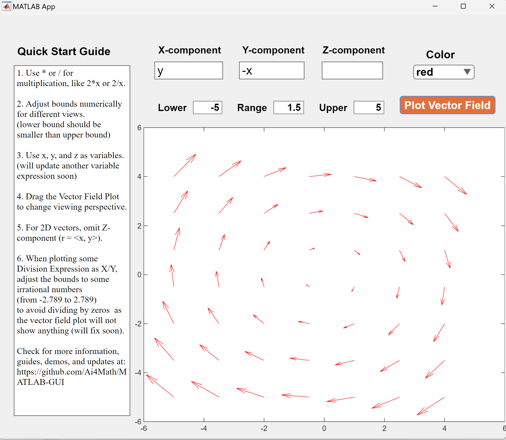

# Vector Field Plotting GUI 
Welcome to the Vector Field Plotting GUI, a MATLAB application designed to empower you with the ability to visualize vector fields in both 2D and 3D. This app provides an intuitive and user-friendly interface to input vector components and generate corresponding vector field plots.

## Updates
- Update Range inputting feature

## How It Works
### Design Overview

The Vector Field Plotting GUI is thoughtfully designed to offer users a simple and friendly interface. Here's a breakdown of the app's components and how it functions:

- **Input Components**: At the core of the app are three input boxes, allowing you to specify the X, Y, and Z components of the vector field you wish to visualize corresponding to r = <x, y, z>. These components are the building blocks of your vector field plot.

- **Plotting Range**: The app also provides an option to define the range of the plotting region. By default, this range spans from -3 to 3, but you can customize it to focus on specific areas of interest within the vector field. The lower bound should be smaller than the larger bound.

- **Color Selection**: The Color Dropdown offers a choice of 8 options to change the colors of the vectors displayed on the plots, with the default color set to red.

- **Plot Button**: Once you've entered the vector components and specified the plotting range (if necessary), you're ready to bring your vector field to life. Click the "Plot" button to initiate the plotting process. The result will appear on the Vector Field Plot below.

### 2D Plotting

In this example, the vector field of <y, -x> is plotted in 2D, therefore, the Z-component box is left blank and after clicking the button, the result is generated as below. Notice that the range is changed from -5 to 5, and the color is defaulted to red.

### 3D Plotitng

In this example, the vector field of <x, y, z> is plotted in 3D, and the result is generated as below. Notice that the range is changed from -2 to 2 and the color is changed to purple.

## Usage
1. **Input Vector Components and Range**:
   - You will find three input boxes: X-component, Y-component, and Z-component. These represent the components of the vector field you wish to visualize in the format of <x,y,z>. If you need to plot a 2D field, simply leave one of the blank.
   - The range can also be modified by entering different numbers in the Lower Bound and Upper Bound boxes. Note that the Lower Bound should be less than the Larger Bound.
   - Choose your favorite color from the dropdown Color menu.

2. **Plot the Vector Field**:
   - After entering the vector components and selecting the dimension and color, simply click the "Plot" button. This action will generate the vector field plot based on your input.

3. **Interact with the Plot**:
   - Once the plot is generated, you can interact with it using standard MATLAB plot controls.
   - For 2D plots, you can zoom in/out, pan, and access other plot-specific options.
   - In the case of 3D plots, you can rotate and explore the field from various angles to gain a comprehensive understanding.

4. **Clear or Redo**:
   - If you wish to start over or make changes to the vector components, simply enter in inputs again and click the Plot button.

## Get Started
1. Clone or download this [MATLAB app](vector_field_input_app.mlapp).
2. Open the app in MATLAB.
3. Follow the usage instructions mentioned above to plot the desired vector field.

## Example Use Cases
Our Vector Field Plotting GUI can be a valuable tool for a variety of applications:

- **Physics Simulations**: Use this app to visualize vector fields in physics simulations, such as electric and magnetic fields. It enables a better understanding of complex electromagnetic phenomena.

- **Engineering Applications**: Analyze fluid flow, stress distributions, or heat transfer in engineering projects. This app aids in optimizing designs and predicting outcomes.

- **Educational Tool**: This app serves as an excellent educational resource for students studying multivariable calculus and electromagnetism. It simplifies complex concepts and promotes learning through visualization.

## References
- You can access the reference MATLAB file for raw usage with Command Line Interface (CLI) by downloading [this MATLAB file](vector_field_input_code.m).
- More information about the vector field concepts and their applications can be found on [Wikipedia](https://en.wikipedia.org/wiki/Vector_field).

